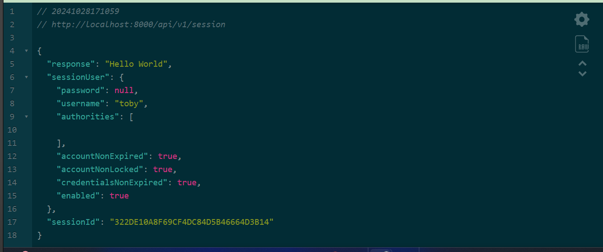
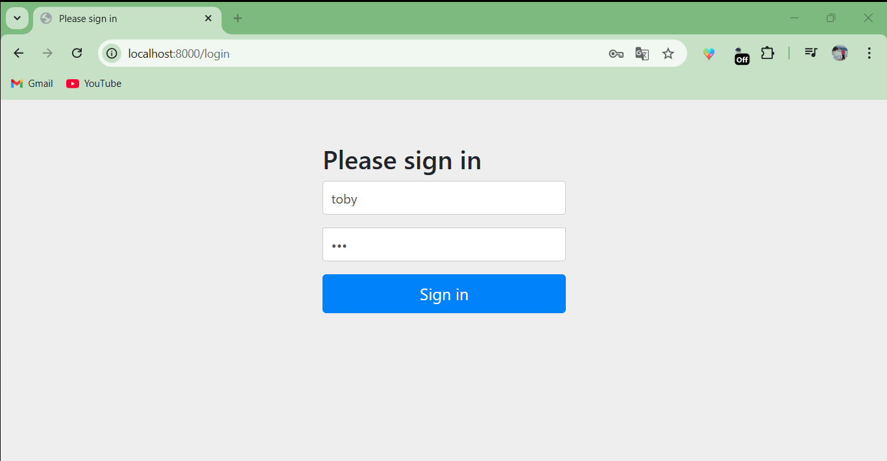
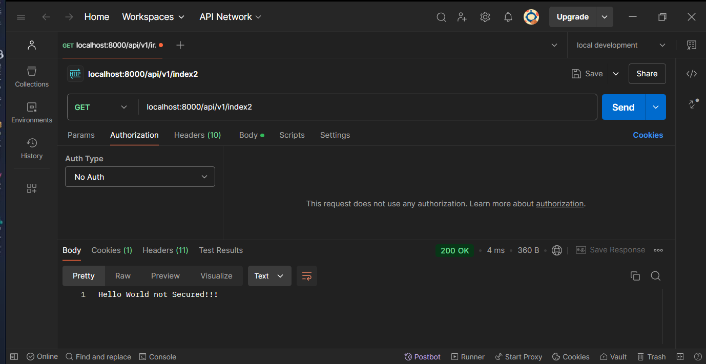
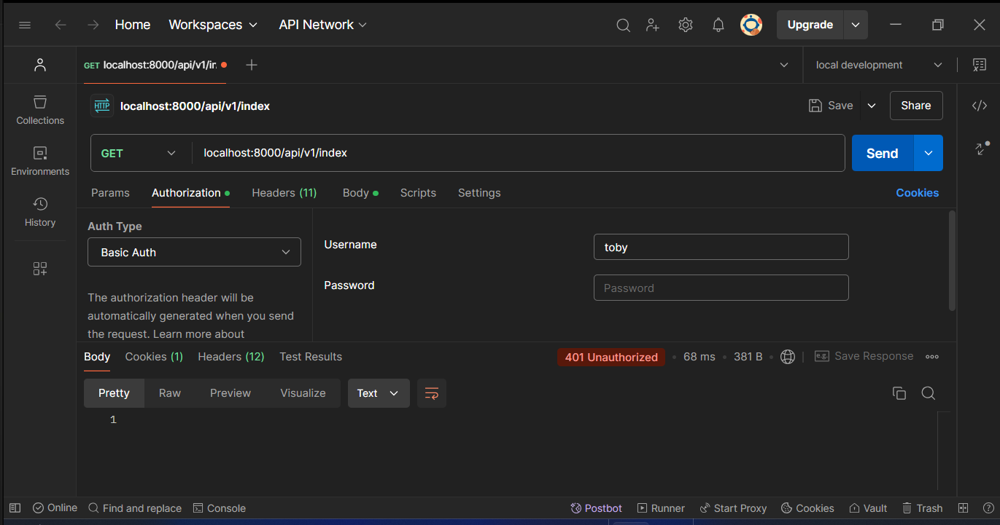
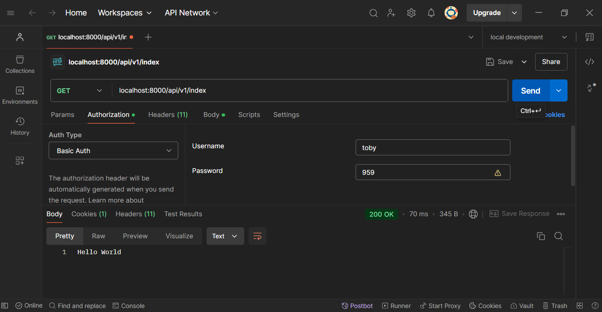
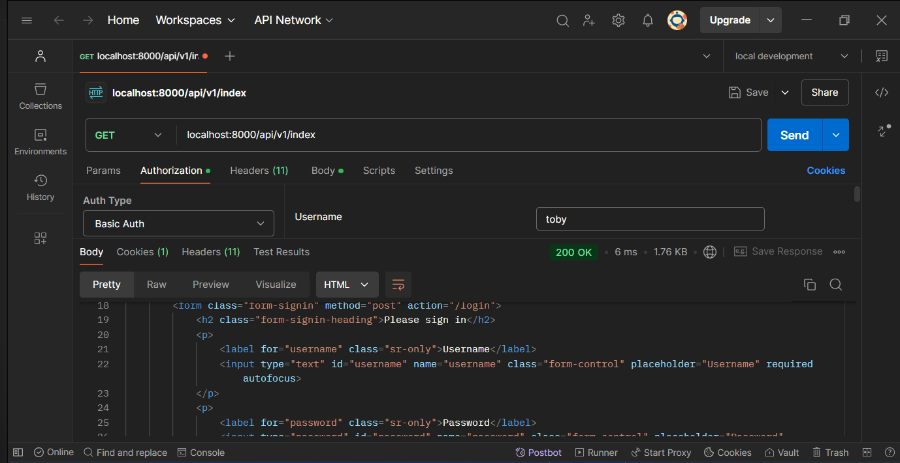

 <h1 aling="center"> Spring Security 📚 </h1>

&nbsp;&nbsp;&nbsp;&nbsp;&nbsp;&nbsp;&nbsp;&nbsp;&nbsp;[](LICENSE)&nbsp;&nbsp;&nbsp;
___
# Descripción 📖
Desarrollo de un proyecto sencillo, para implementar Spring Security. Se debe tener la version de Spring:   
````bash
<parent>
	<groupId>org.springframework.boot</groupId>
	<artifactId>spring-boot-starter-parent</artifactId>
	<version>3.0.6</version>
	<relativePath/> <!-- lookup parent from repository -->
</parent>
````
___
# Recursos:

| Plugin            | URL                      |
|-------------------|--------------------------|
| spring-boot-starter-web  | https://start.spring.io/ |
| spring-boot-starter-security | https://start.spring.io/ |
___
# Imagenes:



La sessionId es protegida por Spring con ".sessionFixation" y ".migrateSession()"   
````
Configuration Two ##
````


````
Configuration One #
````



Se usa ".httpBasic"





Sin ".httpBasic" nos pide registro por Formulario

